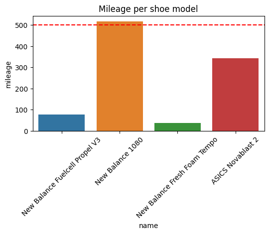
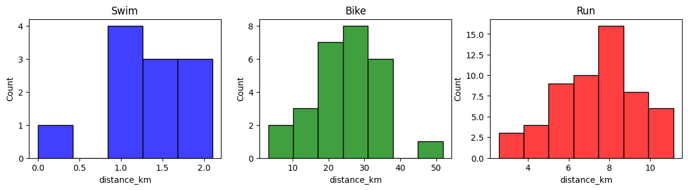
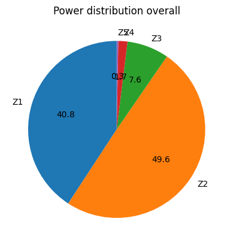

# Strava data analysis

This repo contains a Jupyter Notebook to retrieve workout and athlete data from Strava using the stravalib python library. Some sample post-processing is done here and some plots are generated (e.g. mileage per shoe, distance per sports, bike power distribution).

> The contents here are based on [this medium blog post by @mandieq](https://medium.com/@mandieq/accessing-user-data-via-the-strava-api-using-stravalib-d5bee7fdde17) and her [github repo](https://github.com/mandieq/strava_related).

## Sample plots

Mileage per running shoe model:

Distance per sports:

Bike power distribution overall:

